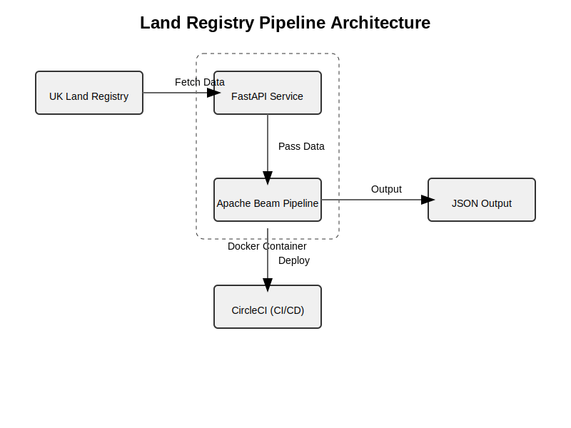

# Data-pipeline-with-apache-beam

## Introduction

This project is designed to collect and process property transaction data from the UK Land Registry. The data is transformed into newline-delimited JSON, with transactions grouped by property. The project is implemented using **Python**, **Apache Beam**, **FastAPI** locally. Scaling it, it can integrates with **Google Cloud** services like **BigQuery** and **Pub/Sub**. The pipeline is containerised with **Docker** and can be deployed and scaled using **Kubernetes**, **Terraform**, and **CircleCI** for CI/CD.

## Architecture


### Key Technologies
- **Apache Beam**: Data processing pipeline.
- **FastAPI**: API to fetch data.
- **Google BigQuery**: Storage for processed data.
- **Google Pub/Sub**: Pub/Sub integration for scheduling the pipeline.
- **Docker**: Containerisation for portability.
- **Kubernetes**: Orchestration for scaling the project.
- **Terraform**: This is the IAAC for provisioning resources on Google Cloud.
- **CircleCI**: CI/CD pipeline.

---

## Project Structure

```
land-registry-pipeline/
├── src/
│   ├── api/
│   │   ├── __init__.py
│   │   └── main.py                 # FastAPI for fetching data from UK Land Registry website
│   ├── pipeline/
│   │   ├── __init__.py
│   │   └── beam_pipeline.py         # Apache Beam pipeline for data transformation
│   └── cloud_function/
│       └── trigger_dataflow.py      # GCP Cloud Function to trigger Apache Beam pipeline on Dataflow
├── tests/
│   ├── test_api.py                  # Unit tests for API
│   └── test_pipeline.py             # Unit tests for Beam pipeline
├── k8s/
│   ├── deployment.yaml              # Kubernetes deployment for FastAPI and Apache Beam
│   ├── service.yaml                 # Kubernetes service configuration
│   └── cronjob.yaml                 # Kubernetes CronJob to schedule pipeline
├── terraform/
│   ├── main.tf                      # Terraform configuration for GCP infrastructure
│   └── variables.tf
├── Dockerfile                       # Docker configuration for building the project
├── docker-compose.yml               # Docker Compose for local development
├── requirements.txt                 # Project dependencies
├── .circleci/
│   └── config.yml                   # CircleCI configuration for CI/CD
└── README.md                        # Project documentation
```

---

## Setup Instructions

### Prerequisites

- Python 3.10+
- Docker and Docker Compose
- Google Cloud account with a project set up
- Google Cloud SDK installed for running `gcloud` commands
- Terraform installed
- Kubernetes cluster (either local or on Google Kubernetes Engine)

### 1. **Install Dependencies**

To install the necessary Python dependencies:

```bash
pip install -r requirements.txt
```

### 2. **Set Up Google Cloud Resources**

This project uses several Google Cloud services, which need to be set up using **Terraform**. 

1. Update the `terraform/variables.tf` with GCP project ID and region.
2. Run the following commands to create the required Google Cloud infrastructure (BigQuery, Pub/Sub, etc.):
   ```bash
   cd terraform/
   terraform init
   terraform apply
   ```

---

## Running the Project Locally

### 1. **Run FastAPI Locally**

FastAPI provides the interface to fetch data from the Land Registry.

To run the FastAPI server locally:

```bash
uvicorn src.api.main:app --reload
#Use the below to fetch data for a specific year range
uvicorn src.api.main_yearly:app --reload
```

This will start the API on `http://127.0.0.1:8000`. You can fetch the Land Registry data by hitting the `/fetch-data` or `/fetch-data-2014-2024` endpoint.

### 2. **Run Apache Beam Pipeline Locally**

To test the Apache Beam pipeline locally, run the following command:

```bash
python src/pipeline/beam_pipeline.py --input_file input.csv --output_file output.json
```

Replace `input.csv` with the path to the Land Registry data file fecthed from the API.

### 3. **Run the Project Using Docker**

You can run the entire project using Docker.

#### Step 1: Build the Docker Image
```bash
docker build -t property-pipeline .
```

#### Step 2: Run the Docker Container
```bash
docker run -p 8000:80 property-pipeline
```

The FastAPI server will now be available at `http://localhost:8000`.

---

## Running in Docker with Docker Compose

For local development, you can use Docker Compose to run both the API and the pipeline:

```bash
docker-compose up
```

This will spin up the FastAPI server and expose it on port 8000. The Beam pipeline can be triggered via the API.

---

## Running the Project on Google Cloud

### 1. **Using Google Dataflow for Apache Beam Pipeline**

To scale the data pipeline, you can run the Apache Beam job on **Google Cloud Dataflow**.

- First, ensure that your GCP credentials are set up:
  ```bash
  gcloud auth application-default login
  ```

- Trigger the pipeline using the **Cloud Function** located in `src/cloud_function/trigger_dataflow.py` or directly from the command line:
  ```bash
  python src/cloud_function/trigger_dataflow.py
  ```

This will execute the pipeline on Google Dataflow using the GCP resources created earlier.

### 2. **Using Pub/Sub to Schedule Pipeline**

You can use **Google Pub/Sub** to trigger the pipeline based on new data or predefined schedules.

- Create a Pub/Sub topic and subscription using Terraform.
- Use the **Cloud Function** to listen to Pub/Sub messages and trigger the Dataflow job.

---

## Deploying to Kubernetes

The project can be containerised and deployed to **Kubernetes** for scalability and management.

### 1. **Deploying the FastAPI App and Pipeline**

- Ensure that your Docker images are built and pushed to a container registry (such as **Google Container Registry** or **Docker Hub**).
  
- Apply the Kubernetes deployment and service configurations:
  
  ```bash
  kubectl apply -f k8s/deployment.yaml
  kubectl apply -f k8s/service.yaml
  ```

This will deploy the FastAPI server and allow to interact with the API in the Kubernetes cluster.

### 2. **Using Kubernetes CronJob to Schedule Pipeline Runs**

You can use the Kubernetes **CronJob** to run the Apache Beam pipeline at scheduled intervals:

```bash
kubectl apply -f k8s/cronjob.yaml
```

This will ensure the pipeline runs on a schedule, such as daily or hourly.

---

## Continuous Integration with CircleCI

This project includes a **CircleCI** configuration file (`.circleci/config.yml`) for automating testing, building, and deploying the project.

### Steps:
1. Link GitHub repository to CircleCI.
2. Update the CircleCI configuration with the necessary credentials for Google Cloud.
3. On every push to the repository, CircleCI will:
   - Run tests using `pytest`.
   - Build and push Docker images.
   - Deploy to Kubernetes cluster or run the Dataflow pipeline.

---

## Connecting to dashboard for visualisation

- Connect BigQuery to business intelligence tools like **Google Data Studio** to analyse the data.

---

## Testing

Unit tests are included for both the API and the Apache Beam pipeline. Run the tests using `pytest`:

```bash
pytest tests/
```

This will run all tests to ensure that both the API and pipeline behave as expected.

---
Thank you!