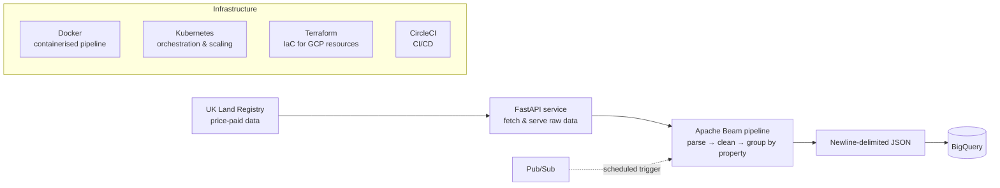

# UK Land Registry Pipeline — Apache Beam on Google Cloud

> Batch/streaming-portable data pipeline that collects UK Land Registry property transactions via a FastAPI service, transforms them with Apache Beam into newline-delimited JSON grouped by property, and scales onto GCP with BigQuery, Pub/Sub, Kubernetes, Terraform, and CircleCI.

## Problem

UK Land Registry price-paid data is published as large flat files of individual transactions. For analysis, what you usually want is the **history of each property** — all transactions grouped by property, in a schema that downstream tools can consume directly.

The engineering challenge: build a transformation pipeline that runs locally for development but scales to cloud volumes **without rewriting the pipeline code**. Apache Beam's model (one pipeline definition, many runners) is the answer this project demonstrates.

## Architecture


```mermaid
flowchart LR
    A[UK Land Registry<br/>price-paid data] --> B[FastAPI service<br/>fetch & serve raw data]
    B --> C[Apache Beam pipeline<br/>parse → clean → group by property]
    C --> D[Newline-delimited JSON]
    D --> E[(BigQuery)]
    F[Pub/Sub] -.->|scheduled trigger| C
    subgraph Infra [Infrastructure]
        G[Docker<br/>containerised pipeline]
        H[Kubernetes<br/>orchestration & scaling]
        I[Terraform<br/>IaC for GCP resources]
        J[CircleCI<br/>CI/CD]
    end
```

**Components:**

- **FastAPI** — lightweight API layer that fetches transaction data from the Land Registry source.
- **Apache Beam** — the core transformation: parse raw records, clean, and group transactions by property into NDJSON. The same pipeline runs on the DirectRunner locally and Dataflow in the cloud.
- **BigQuery** — destination warehouse for processed data at scale.
- **Pub/Sub** — event-driven scheduling of pipeline runs.
- **Docker + Kubernetes** — the pipeline is containerised for portability and orchestrated for scale.
- **Terraform** — all GCP resources provisioned as code.
- **CircleCI** — automated test-and-deploy on every push.

## Project structure

```
land-registry-pipeline/
├── src/
│   ├── api/                # FastAPI service fetching Land Registry data
│   ├── pipeline/           # Apache Beam transformation pipeline
│   └── cloud_function/     # GCP trigger glue
├── terraform/              # IaC for GCP resources
├── Dockerfile
└── .circleci/              # CI/CD config
```

## Setup

```bash
git clone https://github.com/faddaful/data-pipeline-with-apache-beam.git
cd data-pipeline-with-apache-beam

# Local development
pip install -r requirements.txt
uvicorn src.api.main:app --reload        # start the data API
python src/pipeline/beam_pipeline.py     # run Beam on the DirectRunner

# Containerised
docker build -t land-registry-pipeline .
docker run land-registry-pipeline

# Cloud deployment (requires GCP project + credentials)
cd terraform && terraform init && terraform apply
```

## Results

- Raw transaction files are transformed into **property-grouped NDJSON**, ready for direct load into BigQuery or any downstream consumer.
- The identical Beam pipeline code runs **locally and on GCP** — the runner is a config change, not a rewrite.
- Infrastructure is fully reproducible: `terraform apply` stands up the GCP environment from scratch, and CircleCI keeps deployments hands-off.

## What I'd improve next

- Add **dbt** on top of BigQuery for the analytics-layer modelling
- Introduce **data quality gates** (see my [data quality checks project](https://github.com/faddaful/data_quality_checks_demo)) between pipeline stages
- Benchmark DirectRunner vs Dataflow on a full monthly extract

---

*More of my work: [YouTube — codewithIB](https://www.youtube.com/c/codewithib) · [LinkedIn](https://www.linkedin.com/in/ibraheem-olayanju)*
